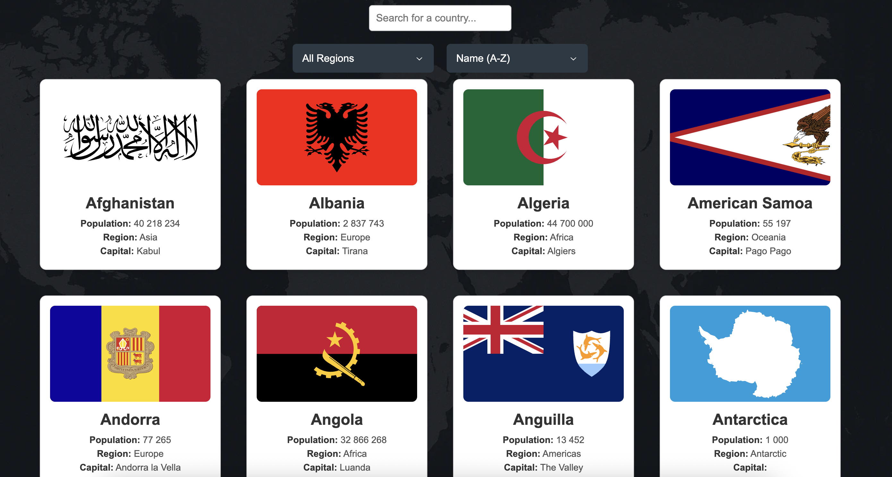
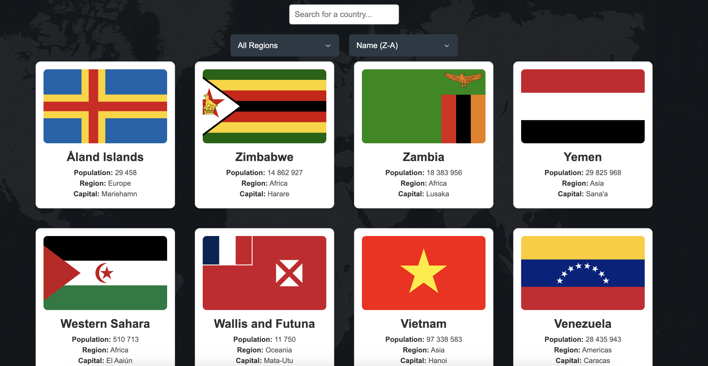

# Country App

Browse countries from around the world, search by name, filter by region, and sort alphabetically. The app uses the REST Countries v3.1 API and is built with React + Vite.

## Live demo

Deployed on Netlify: https://country-app-mikhail.netlify.app/

## Features

- Fetches countries from REST Countries (v3.1) with a lean `fields` query
- Client‑side search by country name
- Filter by region: Africa, Americas, Asia, Europe, Oceania, Antarctic
- Sort A→Z or Z→A by name
- Country cards show flag, name, capital, region, and population
- Custom‑styled dropdowns for a consistent look across browsers
- Simple, responsive layout

## Sorting controls

The app supports ascending (A→Z) and descending (Z→A) sorting by country name.




## Tech stack

- React 19
- Vite 7
- Vanilla CSS
- REST Countries API (v3.1)
- ESLint 9
- Radix UI Select (for fully stylable, accessible dropdowns)

## Getting started

Prerequisites:

- Node.js 18 or newer
- npm (bundled with Node)

Install and run in development:

```bash
npm install
npm run dev
```

Vite will print a local URL (typically `http://localhost:5173`).

Build for production and preview:

```bash
npm run build
npm run preview
```

Lint the project:

```bash
npm run lint
```

## API notes (REST Countries v3.1)

- Base: `https://restcountries.com/v3.1`
- Endpoints used:
  - `GET /all?fields=name,cca2,capital,region,flags,population`
  - `GET /region/{region}?fields=name,cca2,capital,region,flags,population`
- Regions expected by the API: `africa`, `asia`, `europe`, `north america`, `south america`, `oceania`, `antarctic`.
  - Note: Antarctic is `antarctic` (not `antarctica`).
- The app requests specific fields to reduce payload size and avoid 400 errors that can occur when omitting `fields`.

## Radix UI Select (dropdowns)

We use Radix UI Select for the filter and sort dropdowns to get a fully stylable open list with accessible keyboard navigation and screen reader support.

Packages:

- `@radix-ui/react-select` (dropdown primitives)
- `@radix-ui/react-icons` (chevron/check icons)

Where used:

- `src/components/FilterCountry.jsx`
- `src/components/SortDropDown.jsx`

How it’s built (high level):

- Structure: `Select.Root` → `Select.Trigger` → `Select.Portal` → `Select.Content` → `Select.Viewport` → `Select.Item`
- Positioning: `position="popper"`, `align="center"`, `sideOffset={6}`, `collisionPadding={8}`
- Styling: custom classes in `src/App.css` (`.SelectTrigger`, `.SelectContent`, `.SelectViewport`, `.SelectItem`, etc.)

Styling details:

- Font consistency: The app sets `font-family` on `:root, html, body, #root` so Radix portal content inherits the same font (Arial).
- Trigger sizing: `.SelectTrigger` uses `min-width: 220px` on desktop; on mobile (`max-width: 600px`) it becomes `width: 100%` with wrapping container.
- Menu width: `.SelectContent` uses `width: var(--radix-select-trigger-width)` to match the trigger and is capped by `max-width: 100vw`. On mobile it becomes `min(var(--radix-select-trigger-width), 100vw - 16px)` to avoid overflow.
- Viewport bounds: The wrapper `[data-radix-popper-content-wrapper]` is constrained to the viewport on small screens.

Mobile behavior/UX notes:

- Tap responsiveness: We avoid heavy animations on first load for mobile, and set `touch-action: manipulation` plus `-webkit-tap-highlight-color: transparent` on interactive zones and triggers for reliable first‑tap behavior.
- Alignment: Using `align="center"` keeps the dropdown centered on small screens; collision padding prevents the popper from touching screen edges.

Adding options:

To add another option to a dropdown, add a new `Select.Item` with a unique `value` and visible `Select.ItemText` label; handle the value in the parent state:

```jsx
<Select.Item value="example" className="SelectItem">
  <Select.ItemIndicator className="SelectItemIndicator">
    <CheckIcon />
  </Select.ItemIndicator>
  <Select.ItemText className="SelectItemText">Example</Select.ItemText>
  {/* or additional icon/slot */}
  
</Select.Item>
```

Troubleshooting tips:

- If the open list appears off‑center on very narrow devices, ensure the mobile styles in `App.css` are present and that the trigger’s container can wrap.
- If a device shows delayed taps, check that no transform‑based animations run on initial load and that `touch-action: manipulation` is applied on the interactive elements.

Related logic:

- Region split for Americas (North/South) is handled in `src/App.jsx` by switching to the `/subregion/{North|South America}` endpoint. This is separate from Radix but affects the Filter dropdown options.


## Acknowledgements

- Data from REST Countries: https://restcountries.com

## License

This project is open‑sourced under the MIT license.


